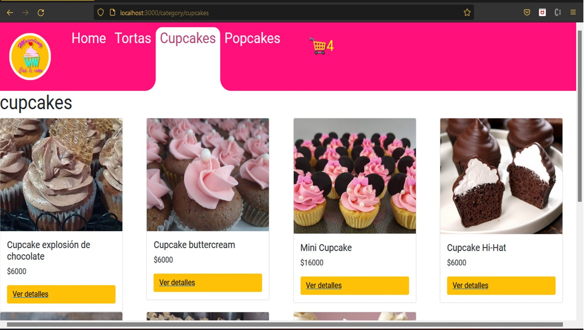

# Mayerling CupCakes

## Introducción
Este es un proyecto que usa ReactJs para visualizar una pastelería llamada Mayerling Cupcakes. Los datos son almacenados en google firestore. El usuario puede selecionar items para comprar, que son mostrados por la aplicación, al seleccionarlo este se almacena en el carrito de compras de donde el usuario puede procesar su orden.


## Logo

<div align="center" style="height:300px;margin-bottom:32px;">
    </img> 
</div>

## Desktop

<div align="center" style="height:250px;margin-bottom:5px;">
    </img> 
</div>

## Descripción

Se crea una App a traves de React Js para un proyecto CoderHouse, esta app se trata de una Pastelería llamada Mayerling CupCakes, la cual vende en su mayoría Tortas y Cupcakes.
https://es.reactjs.org/

## Descripción video

<div align="center" style="height:360px;margin-bottom:5px;">
  <a href="">
    
    <video>
</div>


## Estructura

```

C:\Users\m3jel\OneDrive\Escritorio\proyectoFinal
├── package-lock.json
├── package.json
├── public
|  ├── favicon.ico
|  ├── img
|  ├── index.html
|  ├── logo192.png
|  ├── logo512.png
|  ├── manifest.json
|  └── robots.txt
├── README.md
└── src
   ├── App.css
   ├── App.js
   ├── App.test.js
   ├── componentes
   ├── context
   ├── firebase
   ├── index.css
   ├── index.js
   ├── logo.svg
   ├── productos.js
   ├── provider
   ├── reportWebVitals.js
   └── setupTests.js

```

## Requerimientos

**Bootstrap:** Se puede instalar con
*npm install bootstrap react-bootstrap* 

**Instalar Firebase:**
*npm install firebase@7.24.0*

**Router-dom** se puede instalar con el siguiente comando
_npm install react-router-dom_

## Running
Una vez instalados los paquetes señalados anteriormente, el projecto deberían poder ejecutarse con el comando ***npm start.***
